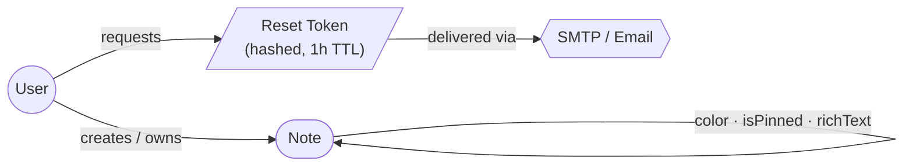
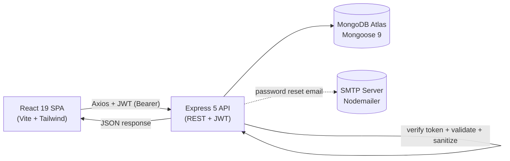

<div align="center">

  <h1>📝 Notes MERN</h1>

  <p><em>A full-stack notes application with JWT authentication, a rich text editor, color coding, pinning, instant search, password reset by email, and a security-hardened MERN architecture.</em></p>

  <p>
    
    
    
    
    
    
    
    
    
    
    
  </p>

  <p>
    <a href="https://notes-mernn.netlify.app/">Live Demo</a> •
    <a href="#features">Features</a> •
    <a href="#installation">Quick Start</a> •
    <a href="#api-endpoints">API Docs</a> •
    <a href="#architecture">Architecture</a>
  </p>

</div>

---

## Features

- **JWT Authentication** — Secure register and login with hashed passwords (bcrypt, 12 salt rounds) and stateless 7-day tokens
- **Password Reset** — Forgot-password flow with hashed, time-limited (1 hour) reset tokens delivered by email via Nodemailer
- **Full CRUD Notes** — Create, read, update, and delete personal notes with strict ownership isolation
- **Rich Text Editor** — Format content with bold, italic, underline, lists, and links through React Quill
- **Color Coding** — Organize notes visually with 7 preset colors
- **Pin Notes** — Keep important notes pinned to the top of the grid
- **Instant Search** — Real-time client-side filtering across note titles and HTML-stripped content
- **Responsive Grid** — Adaptive 1–4 column layout for mobile, tablet, and desktop
- **Delete Confirmation** — Accessible modal dialog prevents accidental deletions
- **Toast Notifications** — Immediate feedback for every action and error
- **Security Hardened** — Helmet, HPP, CORS whitelist, rate limiting, NoSQL injection sanitizer, and server-side HTML sanitization
- **Tested** — Backend API integration tests (Jest + Supertest) and frontend component tests (Vitest + Testing Library)

---

## Live Demo

[🚀 View Live Demo](https://notes-mernn.netlify.app/)

> The frontend is hosted on Netlify and the API on Render. Render free-tier instances sleep when idle, so the first request after inactivity may take a few seconds to wake the server.

---

## Architecture

A high-level visual map of the system. Both diagrams render natively on GitHub thanks to Mermaid support.

### Domain Model

How the core collections relate to each other and where password reset tokens live.



### Request Lifecycle

How a single browser action travels through the stack.



---

## Technologies

### Frontend

- **React 19**: Modern UI library with hooks and context for state management
- **React Router 7**: Declarative client-side routing with protected routes
- **Vite 8**: Lightning-fast build tool and dev server
- **Tailwind CSS 4**: Utility-first CSS framework for rapid, consistent styling
- **Axios**: Promise-based HTTP client with token and 401 interceptors
- **React Quill (new)**: React 19-compatible rich text editor
- **React Hot Toast**: Lightweight, accessible notification toasts

### Backend

- **Node.js**: Server-side JavaScript runtime
- **Express 5**: Minimal and flexible web application framework
- **MongoDB (Mongoose 9)**: NoSQL database with elegant object modeling and compound indexes
- **JWT**: Stateless authentication with 7-day Bearer tokens
- **bcryptjs**: Password hashing with 12 salt rounds
- **Helmet**: Secure HTTP headers
- **HPP**: HTTP parameter pollution protection
- **express-validator**: Request body and param validation
- **express-rate-limit**: Brute-force and abuse protection on auth routes
- **sanitize-html**: Server-side HTML sanitization to neutralize stored XSS
- **Nodemailer**: Transactional emails for the password reset flow

### Testing

- **Jest + Supertest**: Backend API integration tests against an in-memory MongoDB (`mongodb-memory-server`)
- **Vitest + Testing Library**: Frontend component unit tests in a jsdom environment

---

## Installation

### Prerequisites

- **Node.js** v18+ and **npm**
- **MongoDB** — MongoDB Atlas (free tier) or a local instance

### Local Development

**1. Clone the repository:**

```bash
git clone https://github.com/Serkanbyx/notes-mern.git
cd notes-mern
```

**2. Set up environment variables:**

```bash
cp server/.env.example server/.env
cp client/.env.example client/.env
```

**server/.env**

```env
MONGO_URI=your_mongodb_connection_string
JWT_SECRET=your_strong_random_secret
PORT=5000
NODE_ENV=development
CLIENT_URL=http://localhost:5173

# SMTP — required only for the password reset feature
SMTP_HOST=smtp.gmail.com
SMTP_PORT=587
SMTP_USER=your_email@gmail.com
SMTP_PASS=your_app_password
SMTP_FROM=your_email@gmail.com
```

**client/.env**

```env
VITE_API_URL=http://localhost:5000/api
```

**3. Install dependencies:**

```bash
cd server && npm install
cd ../client && npm install
```

**4. Run the application:**

```bash
# Terminal 1 — Backend
cd server && npm run dev

# Terminal 2 — Frontend
cd client && npm run dev
```

Open **http://localhost:5173** in your browser.

**5. Run the tests (optional):**

```bash
# Backend
cd server && npm test

# Frontend
cd client && npm test
```

---

## Usage

1. **Register** a new account with your name, email, and a password (min. 6 characters).
2. **Log in** to receive a JWT that is stored locally and attached to every API request.
3. **Create a note** with the floating action button — add a title, format the body with the rich text editor, and pick a color.
4. **Pin** important notes to keep them at the top, **edit** or **delete** notes from each card (delete asks for confirmation).
5. **Search** instantly by typing in the search bar — it filters across titles and content in real time.
6. **Forgot your password?** Request a reset link by email, then set a new password from the link (valid for 1 hour).
7. **Log out** from the navbar to clear your session.

---

## How It Works?

### Authentication Flow

On register/login the API hashes/validates the password, signs a JWT, and returns it with the user profile. The client persists the token and user in `localStorage` and exposes auth state through React context.

```js
// server — sign a stateless 7-day token
const generateToken = (userId) =>
  jwt.sign({ userId }, process.env.JWT_SECRET, { expiresIn: "7d" });
```

### Request Authorization

Every request from the client automatically carries the token, and any `401` globally clears the session and redirects to login.

```js
// client — axiosInstance.js
axiosInstance.interceptors.request.use((config) => {
  const token = localStorage.getItem("token");
  if (token) config.headers.Authorization = `Bearer ${token}`;
  return config;
});
```

### Protected Routes & Ownership

Note routes are guarded by a `verifyToken` middleware, request data is checked by a centralized `handleValidation` middleware, and a dedicated `checkNoteOwnership` middleware loads the note and enforces that it belongs to the authenticated user before any read/update/delete.

### Defense in Depth

User-supplied note HTML is sanitized server-side with an allowlist before it is stored, so saved content can never carry executable markup — even though the UI only renders stripped text in cards.

```js
// server — sanitizeContent.js (allowlist mirrors the Quill toolbar)
allowedTags: ["p", "br", "b", "strong", "i", "em", "u", "s", "ol", "ul", "li", "a"],
```

---

## API Endpoints

Base URL: `/api`

| Method   | Endpoint                       | Auth | Description                                   |
| -------- | ------------------------------ | ---- | --------------------------------------------- |
| `POST`   | `/auth/register`               | No   | Create a new account and receive a JWT        |
| `POST`   | `/auth/login`                  | No   | Sign in and receive a JWT                     |
| `POST`   | `/auth/forgot-password`        | No   | Send a password reset link by email           |
| `POST`   | `/auth/reset-password/:token`  | No   | Set a new password using the email token       |
| `GET`    | `/notes`                       | Yes  | Get all notes (pinned first, then most recent) |
| `GET`    | `/notes/:id`                   | Yes  | Get a single note                             |
| `POST`   | `/notes`                       | Yes  | Create a new note                             |
| `PUT`    | `/notes/:id`                   | Yes  | Update a note                                 |
| `PATCH`  | `/notes/:id/pin`               | Yes  | Toggle pin / unpin                            |
| `DELETE` | `/notes/:id`                   | Yes  | Delete a note                                 |
| `GET`    | `/health`                      | No   | Service health check                          |

> Protected endpoints require an `Authorization: Bearer <token>` header.
> Auth routes are rate limited to **10 requests per 15 minutes** per IP.
> Available note colors: `yellow` `green` `blue` `purple` `pink` `red` `orange`.

---

## Project Structure

A clean monorepo layout with an explicit backend / frontend split. Each panel below is collapsible — expand the one you care about.

<details open>
<summary><b>Server</b> — Express 5 API</summary>

```
server/
├── config/          # Mongoose connection with timeout
├── controllers/     # auth (register, login, forgot/reset), notes (CRUD + pin)
├── middleware/      # verifyToken, checkNoteOwnership, handleValidation
├── models/          # User (with reset token), Note (color enum, indexes)
├── routes/          # authRoutes (rate limited), noteRoutes (protected)
├── validators/      # authValidator, noteValidator (express-validator chains)
├── utils/           # sendEmail (Nodemailer), sanitizeContent (HTML allowlist)
├── tests/           # Jest + Supertest integration tests + in-memory DB setup
├── app.js           # Express app: middleware, routes, global error handler
├── server.js        # Entry: DB connect + landing page + listen
├── jest.config.js
├── .env.example
└── package.json
```

</details>

<details>
<summary><b>Client</b> — React 19 + Vite SPA</summary>

```
client/
├── public/          # static assets (favicon, icons)
├── src/
│   ├── api/         # Axios instance + token/401 interceptors
│   ├── components/  # ColorPicker, ConfirmDialog, Navbar, NoteCard,
│   │                #   NoteList, NoteModal, ProtectedRoute, SearchBar, Spinner
│   ├── context/     # AuthContext (login/register/logout state)
│   ├── hooks/       # useNotes (CRUD + optimistic state & sorting)
│   ├── pages/       # Home, Login, Register, ForgotPassword, ResetPassword
│   ├── tests/       # Vitest component tests + setup
│   ├── App.jsx      # routes + Toaster + Navbar
│   ├── main.jsx     # entry: BrowserRouter + AuthProvider
│   └── index.css    # Tailwind import + Quill overrides
├── netlify.toml     # SPA redirect config
├── vite.config.js   # React + Tailwind v4 + Vitest config
├── .env.example
└── package.json
```

</details>

<details>
<summary><b>Repository root</b> — governance & deployment</summary>

```
notes-mern/
├── client/          # → see Client panel above
├── server/          # → see Server panel above
├── .github/         # issue templates, PR template, CODE_OF_CONDUCT, CONTRIBUTING, SECURITY
├── render.yaml      # Render deployment blueprint
├── .gitignore
├── LICENSE
└── README.md
```

</details>

---

## Security

- **Password Hashing** — Passwords are hashed with bcryptjs using 12 salt rounds and never returned in responses
- **Stateless Authentication** — JWT with 7-day expiry, sent via the `Authorization: Bearer` scheme
- **Secure HTTP Headers** — Helmet applies CSP, HSTS, X-Frame-Options, and more
- **Parameter Pollution** — HPP strips duplicated query parameters
- **NoSQL Injection** — Custom sanitizer removes keys containing `$` or `.` from the request body
- **XSS Protection** — Note content is sanitized server-side with `sanitize-html` using a strict tag allowlist
- **CORS Whitelist** — Only the configured frontend origin is allowed
- **Rate Limiting** — 10 requests per 15 minutes on authentication routes
- **Body Size Limit** — 10KB cap on JSON and URL-encoded payloads
- **Ownership Isolation** — Every note operation verifies the `userId` matches the authenticated user
- **Password Reset Safety** — Reset tokens are SHA-256 hashed before storage, expire after 1 hour, and the endpoint is email-enumeration safe

---

## Deployment

### Backend — [Render](https://render.com/)

A `render.yaml` blueprint is included for automatic setup. Configure these environment variables in the Render dashboard:

| Variable                 | Value                                      |
| ------------------------ | ------------------------------------------ |
| `MONGO_URI`              | MongoDB Atlas connection string            |
| `JWT_SECRET`             | Strong random secret key                   |
| `CLIENT_URL`             | Netlify frontend URL (CORS whitelist)      |
| `NODE_ENV`               | `production`                               |
| `SMTP_HOST` / `SMTP_PORT`| Mail server host and port (password reset) |
| `SMTP_USER` / `SMTP_PASS`| Mail account credentials (password reset)  |
| `SMTP_FROM`              | From address shown on reset emails         |

### Frontend — [Netlify](https://www.netlify.com/)

| Setting              | Value                                          |
| -------------------- | ---------------------------------------------- |
| Base directory       | `client`                                       |
| Build command        | `npm run build`                                |
| Publish directory    | `dist`                                         |
| Environment variable | `VITE_API_URL=https://your-api.onrender.com/api` |

> SPA routing is handled by the included `netlify.toml`.

---

## Features in Detail

**Completed**

- ✅ JWT register / login with hashed passwords
- ✅ Password reset by email (hashed, time-limited tokens)
- ✅ Full notes CRUD with ownership isolation
- ✅ Rich text editor, color coding, and pinning
- ✅ Instant client-side search
- ✅ Server-side validation, sanitization, and security hardening
- ✅ Backend and frontend test suites

**Future Ideas**

- [ ] Tags / folders for grouping notes
- [ ] Drag-and-drop note reordering
- [ ] Dark mode
- [ ] Note sharing / collaboration
- [ ] Offline support (PWA)

---

## Contributing

Contributions are welcome! Please read the [Contributing Guide](.github/CONTRIBUTING.md) and the [Code of Conduct](.github/CODE_OF_CONDUCT.md) before getting started.

1. Fork the repository
2. Create your feature branch (`git checkout -b feature/amazing-feature`)
3. Commit your changes (`git commit -m 'feat: add amazing feature'`)
4. Push to the branch (`git push origin feature/amazing-feature`)
5. Open a Pull Request

Commit message conventions:

| Prefix      | Description                        |
| ----------- | ---------------------------------- |
| `feat:`     | New feature                        |
| `fix:`      | Bug fix                            |
| `refactor:` | Code refactoring                   |
| `docs:`     | Documentation changes              |
| `chore:`    | Maintenance and dependency updates |

---

## License

This project is open source and available under the [MIT License](LICENSE).

---

## Developer

**Serkanby**

- 🌐 Website: [serkanbayraktar.com](https://serkanbayraktar.com/)
- 💻 GitHub: [@Serkanbyx](https://github.com/Serkanbyx)
- ✉️ Email: [serkanbyx1@gmail.com](mailto:serkanbyx1@gmail.com)

---

## Acknowledgments

- [React](https://react.dev/) and [Vite](https://vite.dev/) for the frontend foundation
- [Express](https://expressjs.com/) and [Mongoose](https://mongoosejs.com/) for the API and data layer
- [Tailwind CSS](https://tailwindcss.com/) for styling
- [React Quill (new)](https://github.com/VaguelySerious/react-quill-new) for the rich text editor
- [sanitize-html](https://github.com/apostrophecms/sanitize-html) and [Helmet](https://helmetjs.github.io/) for security

---

## Contact

- 🐛 [Open an Issue](https://github.com/Serkanbyx/notes-mern/issues)
- ✉️ Email: [serkanbyx1@gmail.com](mailto:serkanbyx1@gmail.com)
- 🌐 Website: [serkanbayraktar.com](https://serkanbayraktar.com/)

---

⭐ If you like this project, don't forget to give it a star!
