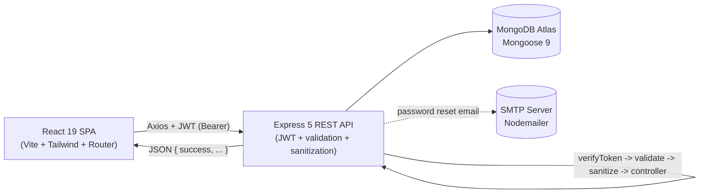

# Notes MERN — Step-by-Step Build Guide

> **Archived: original build playbook.** This document is the original step-by-step roadmap used to build the Notes MERN application. It is preserved as a making-of narrative: the codebase may have evolved since the guide was written, so treat it as the intended build order rather than a precise mirror of the current source. For current setup, architecture, and deployment notes, see [../README.md](../README.md).

---

> **Project Summary:** Notes MERN is a full-stack notes application. Authenticated users can create, read, update, delete, color-code, pin, and instantly search personal notes written in a rich text editor. Authentication is JWT-based with bcrypt-hashed passwords and an email-driven password reset flow backed by hashed, time-limited tokens. The backend is a security-hardened Express 5 REST API (Helmet, HPP, CORS whitelist, rate limiting, NoSQL sanitization, and server-side HTML sanitization) over MongoDB via Mongoose 9. The frontend is a React 19 single-page app built with Vite 8 and Tailwind CSS 4, with route protection, an Axios layer that injects tokens and handles `401`s globally, and toast-driven feedback. Both layers ship with automated tests.

Each step below is a self-contained prompt. Execute them in order.

Stack: React 19, React Router 7, Vite 8, Tailwind CSS 4, Axios, React Quill, React Hot Toast (client) · Node.js, Express 5, Mongoose 9, MongoDB Atlas, JWT, bcryptjs, Helmet, HPP, express-validator, express-rate-limit, sanitize-html, Nodemailer (server) · Jest, Supertest, mongodb-memory-server, Vitest, Testing Library (tests).

---

## Table of Contents

**PHASE 1 — Backend Foundation**

- STEP 1 — Project Scaffolding & Dependency Setup
- STEP 2 — Express App & Security Middleware
- STEP 3 — Database Connection & Server Entry

**PHASE 2 — Backend Resources**

- STEP 4 — User Model & Reset Token Method
- STEP 5 — Note Model & Indexes
- STEP 6 — Validators & Cross-Cutting Middleware
- STEP 7 — Auth Controller & Routes
- STEP 8 — Note Controller & Routes
- STEP 9 — Email Utility (Password Reset)
- STEP 10 — Backend Integration Tests

**PHASE 3 — Client Foundation**

- STEP 11 — Client Scaffolding (Vite + Tailwind v4)
- STEP 12 — Axios Instance & Auth Context
- STEP 13 — Routing & Protected Routes

**PHASE 4 — Client Pages**

- STEP 14 — Authentication Pages
- STEP 15 — Password Reset Pages
- STEP 16 — Notes UI Components
- STEP 17 — useNotes Hook & Home Dashboard
- STEP 18 — Frontend Component Tests

**PHASE 5 — Polish & Deploy**

- STEP 19 — Security, Accessibility & Performance Pass
- STEP 20 — Deployment (Render + Netlify)

**Appendices**

- Appendix A — Shared Constants
- Appendix B — Common Pitfalls
- Appendix C — Pre-flight Checklist

---

## Global Build Rules (apply to EVERY step)

- **No git operations.** Do not run `git` commands, do not commit, and do not push. Version control is handled manually by the user.
- Do not install unapproved packages. Only add the dependencies named in the step you are executing.
- Do not start long-running processes (dev servers, watchers) unless the step explicitly requires it.
- Treat every step as self-contained: read the relevant files first, then make the change.
- Prefer modern syntax: ES6+, async/await, React Hooks, functional components.
- Keep secrets in `.env`; commit only `.env.example` with placeholder values.
- After substantive edits, run the test suite and linter for the layer you touched.
- Maintain consistent naming: camelCase for variables/functions, descriptive English identifiers.

---

## Architecture at a Glance

The client SPA talks to the Express API over REST with a JWT Bearer token. The API persists data in MongoDB through Mongoose and sends password reset emails through an SMTP transport.



Request pipeline order on the server: CORS -> Helmet -> HPP -> body parsers -> NoSQL sanitizer -> route (rate limit / verifyToken) -> validator chain -> `handleValidation` -> ownership check (notes) -> controller -> global error handler.

---

# PHASE 1 — BACKEND FOUNDATION

---

## STEP 1 — Project Scaffolding & Dependency Setup

**Goal:** Create the `server/` workspace with its dependency manifest, scripts, and environment template.

**Files/folders to create:**

- `server/package.json`
- `server/.env.example`
- `server/.gitignore` (ignore `node_modules`, `.env`)

**Dependencies:**

```bash
cd server
npm init -y
npm install express mongoose jsonwebtoken bcryptjs dotenv cors helmet hpp express-validator express-rate-limit sanitize-html nodemailer
npm install --save-dev jest supertest mongodb-memory-server @jest/globals
```

**Implementation notes:**

- Set `"type": "commonjs"` and `"main": "server.js"`.
- Scripts:
  - `"start": "node server.js"`
  - `"dev": "node --watch server.js"` (native watch, no nodemon)
  - `"test": "jest --forceExit --detectOpenHandles"`
  - `"test:watch": "jest --watch --forceExit --detectOpenHandles"`
- `.env.example` keys: `MONGO_URI`, `JWT_SECRET`, `PORT`, `NODE_ENV`, `CLIENT_URL`, plus SMTP keys (`SMTP_HOST`, `SMTP_PORT`, `SMTP_USER`, `SMTP_PASS`, `SMTP_FROM`). See Appendix A.

**Acceptance:** `npm run dev` fails only because `app.js`/`server.js` do not exist yet; dependencies install cleanly.

---

## STEP 2 — Express App & Security Middleware

**Goal:** Build the composable Express app separately from the server bootstrap so it can be imported by tests.

**Files to create:** `server/app.js`

**Implementation notes:**

- Export an `app` instance (no `listen`, no DB connect here).
- Configure CORS with an origin whitelist derived from `CLIENT_URL` (comma-separated, trimmed); allow no-origin requests and `credentials: true`.
- Apply Helmet with `crossOriginResourcePolicy: { policy: "cross-origin" }` and `crossOriginOpenerPolicy: { policy: "same-origin-allow-popups" }`.
- Apply `hpp()`.
- Body parsers with a `10kb` limit for JSON and URL-encoded payloads.
- Add a custom NoSQL injection sanitizer that recursively deletes keys starting with `$` or containing `.` — scoped to `req.body` only (do not mutate `req.headers` or `req.query`).
- Mount routes at `/api/auth` and `/api/notes` (created later).
- Add `GET /api/health` returning `{ success, status, uptime, timestamp }`.
- Add a global error handler (last middleware) that maps:
  - Mongo duplicate key (`err.code === 11000`) -> `409`
  - Mongoose `ValidationError` -> `400` with field errors
  - default -> `err.statusCode || 500`, hiding stack/message in production.

**Acceptance:** Importing `app` does not throw; `GET /api/health` returns healthy JSON once wired.

---

## STEP 3 — Database Connection & Server Entry

**Goal:** Connect to MongoDB and start the HTTP server, with a styled landing page for the API root.

**Files to create:** `server/config/db.js`, `server/server.js`

**Implementation notes:**

- `config/db.js`: `connectDB()` calls `mongoose.connect(process.env.MONGO_URI, { serverSelectionTimeoutMS: 5000 })`; log host on success, `process.exit(1)` on failure.
- `server.js`:
  - `require("dotenv").config()` at the very top.
  - `require("./app")` and `require("./config/db")`.
  - Serve an HTML landing page at `GET /` that displays the API name, the version from `package.json`, and a link to `/api/health`.
  - `startServer()` awaits `connectDB()` then `app.listen(PORT)`.

**Acceptance:** `npm run dev` connects to MongoDB and logs the listening port; visiting `/` shows the landing page.

---

# PHASE 2 — BACKEND RESOURCES

---

## STEP 4 — User Model & Reset Token Method

**Goal:** Define the `User` schema with hidden sensitive fields and a password-reset token helper.

**Files to create:** `server/models/User.js`

**Implementation notes:**

- Fields: `name` (2–50 chars, trimmed), `email` (unique, lowercased, trimmed), `password` (min 6, `select: false`), `resetPasswordToken` (`select: false`), `resetPasswordExpires` (`select: false`); `{ timestamps: true }`.
- Method `createPasswordResetToken()`:
  - Generate `crypto.randomBytes(32).toString("hex")` as the raw token.
  - Store the SHA-256 hash of the raw token in `resetPasswordToken`.
  - Set `resetPasswordExpires` to `Date.now() + 60 * 60 * 1000` (1 hour).
  - Return the raw (unhashed) token to be emailed.

**Security:** Never store the raw reset token; never select `password`/reset fields by default.

**Acceptance:** Creating a user and calling the method yields a raw token while persisting only its hash.

---

## STEP 5 — Note Model & Indexes

**Goal:** Define the `Note` schema with a color enum and query-optimized indexes.

**Files to create:** `server/models/Note.js`

**Implementation notes:**

- Fields: `title` (required, trimmed, max 100), `content` (string, default `""`), `color` (enum of the 7 colors in Appendix A, default `yellow`), `isPinned` (boolean, default `false`), `userId` (`ObjectId`, ref `User`, required, indexed); `{ timestamps: true }`.
- Add a compound index: `{ userId: 1, isPinned: -1, updatedAt: -1 }` to match the default listing sort.

**Acceptance:** Invalid colors are rejected at the model layer; listing queries use the compound index.

---

## STEP 6 — Validators & Cross-Cutting Middleware

**Goal:** Centralize request validation, token verification, and note ownership checks.

**Files to create:**

- `server/validators/authValidator.js` — `registerValidator`, `loginValidator`, `forgotPasswordValidator`, `resetPasswordValidator`
- `server/validators/noteValidator.js` — `objectIdValidator`, `createNoteValidator`, `updateNoteValidator`
- `server/middleware/handleValidation.js`
- `server/middleware/verifyToken.js`
- `server/middleware/checkNoteOwnership.js`

**Implementation notes:**

- Validators use `express-validator` chains (`body`, `param`). `objectIdValidator` checks `mongoose.Types.ObjectId.isValid`.
- `handleValidation`: runs `validationResult(req)`; on errors returns `400 { success: false, errors }`; otherwise `next()`. This is the single place validation is enforced — controllers stay clean.
- `verifyToken`: requires `Authorization: Bearer <token>`, verifies with `JWT_SECRET`, sets `req.user = { userId }`, returns `401` otherwise.
- `checkNoteOwnership`: loads the note by `req.params.id`; `404` if missing, `403` if `note.userId` differs from `req.user.userId`; attaches `req.note`. It assumes param validation already ran via the validator chain + `handleValidation`.

**Acceptance:** Validation errors short-circuit before controllers; protected routes reject missing/invalid tokens; cross-user note access returns `403`.

---

## STEP 7 — Auth Controller & Routes

**Goal:** Implement register, login, forgot-password, and reset-password with rate limiting.

**Files to create:** `server/controllers/authController.js`, `server/routes/authRoutes.js`

**Implementation notes:**

- `generateToken(userId)` signs a 7-day JWT.
- `register`: reject duplicate email with `409`; hash password with bcrypt (12 rounds); return token + safe user object (`_id`, `name`, `email`).
- `login`: select `+password`; compare with bcrypt; return `401 "Invalid credentials"` for both unknown email and wrong password (no enumeration).
- `forgotPassword`: always respond `200` with a generic message (email enumeration safe). If the user exists, create a reset token, save it, build `${CLIENT_URL}/reset-password/${rawToken}`, and email it; on email failure, clear the token fields and return `500`.
- `resetPassword`: hash the `:token` param, find a user with a matching unexpired token, set a new bcrypt hash, clear reset fields.
- Routes apply an `authLimiter` (`express-rate-limit`: 15-minute window, max 10) and the validator chain + `handleValidation` before each controller.

**Acceptance:** All four endpoints behave per the API table in the README; auth routes are rate limited.

---

## STEP 8 — Note Controller & Routes

**Goal:** Implement notes CRUD plus pin toggle, with server-side HTML sanitization.

**Files to create:** `server/controllers/noteController.js`, `server/routes/noteRoutes.js`, and the sanitizer (STEP 9 util is email; create `server/utils/sanitizeContent.js` here).

**Implementation notes:**

- `sanitizeContent.js`: wrap `sanitize-html` with an allowlist mirroring the Quill toolbar (`p, br, b, strong, i, em, u, s, ol, ul, li, a`), allow `href/target/rel` on `a`, schemes `http/https/mailto`, and force `rel="noopener noreferrer" target="_blank"` on links. Return non-strings untouched.
- `getAllNotes`: find by `userId`, sort `{ isPinned: -1, updatedAt: -1 }`, return `count` + `notes`.
- `getNoteById`: return `req.note` (ownership middleware already loaded it).
- `createNote`: sanitize `content` before `Note.create`.
- `updateNote`: update title/color with `??`; for content use `content !== undefined ? sanitizeContent(content) : note.content` so intentional clears persist.
- `togglePin`: flip `isPinned`, save.
- `deleteNote`: `req.note.deleteOne()`.
- Routes: `router.use(verifyToken)`, then wire each route with its validator chain + `handleValidation` (+ `checkNoteOwnership` for `:id` routes).

**Acceptance:** A note containing `<script>` is stored without the script tag but keeps allowed formatting; ownership is enforced on every `:id` route.

---

## STEP 9 — Email Utility (Password Reset)

**Goal:** Provide a reusable Nodemailer transport and a branded reset email template.

**Files to create:** `server/utils/sendEmail.js`

**Implementation notes:**

- `createTransporter()` reads `SMTP_HOST`, `SMTP_PORT` (default 587), `secure` when port is 465, and `SMTP_USER`/`SMTP_PASS`.
- `sendEmail({ to, subject, html })` sends from `SMTP_FROM || SMTP_USER`.
- `buildResetEmailHtml(userName, resetUrl)` returns a responsive HTML email with a reset button, the raw URL fallback, and a 1-hour expiry note.

**Acceptance:** With valid SMTP env vars, the forgot-password flow delivers a working reset link.

---

## STEP 10 — Backend Integration Tests

**Goal:** Cover auth and notes against an in-memory MongoDB.

**Files to create:** `server/jest.config.js`, `server/tests/setup.js`, `server/tests/helpers.js`, `server/tests/auth.test.js`, `server/tests/notes.test.js`

**Implementation notes:**

- `jest.config.js`: `testEnvironment: "node"`, `testMatch: ["**/tests/**/*.test.js"]`, `testTimeout: 30000`.
- `setup.js`: spin up `MongoMemoryServer` in `beforeAll`, disconnect/stop in `afterAll`, clear all collections in `afterEach`.
- `helpers.js`: `createTestUser`, `generateTestToken`, `createTestNote`.
- Cover: register/login success and failures (`400/401/409`), notes list ownership isolation, create defaults, invalid color `400`, update/delete `403` for other users, `404` for missing notes, pin toggle, and an XSS sanitization assertion (script stripped, `<strong>` kept).

**Acceptance:** `npm test` passes all suites with no open handles.

---

# PHASE 3 — CLIENT FOUNDATION

---

## STEP 11 — Client Scaffolding (Vite + Tailwind v4)

**Goal:** Create the React 19 SPA with Tailwind v4 and Vitest configured.

**Dependencies:**

```bash
cd client
npm create vite@latest . -- --template react
npm install axios react-router-dom react-hot-toast react-quill-new
npm install --save-dev tailwindcss @tailwindcss/vite vitest jsdom @testing-library/react @testing-library/jest-dom @testing-library/user-event
```

**Files to create/edit:** `client/vite.config.js`, `client/src/index.css`, `client/index.html`, `client/.env.example`

**Implementation notes:**

- `vite.config.js`: plugins `react()` and `tailwindcss()`; add a `test` block (`environment: "jsdom"`, `globals: true`, `setupFiles: "./src/tests/setup.js"`, `css: false`).
- `index.css`: `@import 'tailwindcss';` plus `.note-editor` overrides for the Quill toolbar/container.
- `index.html`: `lang="en"`, English title/description, theme-color.
- `.env.example`: `VITE_API_URL=http://localhost:5000/api`.
- Netlify config lives in a single root `netlify.toml` (see STEP 20), not in `client/`.

**Acceptance:** `npm run dev` serves a blank styled app; `npm test` runs (no tests yet).

---

## STEP 12 — Axios Instance & Auth Context

**Goal:** Centralize HTTP config and authentication state.

**Files to create:** `client/src/api/axiosInstance.js`, `client/src/context/AuthContext.jsx`

**Implementation notes:**

- `axiosInstance`: `baseURL: import.meta.env.VITE_API_URL`; request interceptor attaches `Bearer` token from `localStorage`; response interceptor clears auth and redirects to `/login` on `401`.
- `AuthContext`: state seeded from `localStorage` (`user`, `token`); `login`, `register`, `logout` persist/clear storage and fire toasts; export a `useAuth` hook that throws outside the provider.

**Acceptance:** Token is attached automatically; a forced `401` logs the user out.

---

## STEP 13 — Routing & Protected Routes

**Goal:** Wire the router, providers, navbar, toaster, and the route guard.

**Files to create/edit:** `client/src/main.jsx`, `client/src/App.jsx`, `client/src/components/ProtectedRoute.jsx`

**Implementation notes:**

- `main.jsx`: `StrictMode` > `BrowserRouter` > `AuthProvider` > `App`; import `index.css`.
- `App.jsx`: render `Toaster` + `Navbar`; public routes (`/login`, `/register`, `/forgot-password`, `/reset-password/:token`) redirect to `/` when a token exists; protected `/` is nested under `ProtectedRoute`; catch-all redirects to `/`.
- `ProtectedRoute`: redirect to `/login` when no token, else render `<Outlet />`.

**Acceptance:** Unauthenticated users hitting `/` are redirected to `/login`; authenticated users on auth pages are redirected home.

---

# PHASE 4 — CLIENT PAGES

---

## STEP 14 — Authentication Pages

**Goal:** Build accessible login and register forms with client-side validation.

**Files to create:** `client/src/pages/LoginPage.jsx`, `client/src/pages/RegisterPage.jsx`

**Implementation notes:**

- Controlled inputs with per-field validation on blur and submit; focus the first invalid field.
- Map server validation errors (`data.errors[].path/param`) back to fields; show a general alert region with `role="alert"`.
- Use `aria-invalid` / `aria-describedby` on inputs; show a `Spinner` while submitting.
- Login links to `/forgot-password` and `/register`; register enforces name 2–50, valid email, password min 6.

**Acceptance:** Invalid submissions are blocked client-side; server errors surface inline and via toast.

---

## STEP 15 — Password Reset Pages

**Goal:** Build the forgot-password request and the token-based reset forms.

**Files to create:** `client/src/pages/ForgotPasswordPage.jsx`, `client/src/pages/ResetPasswordPage.jsx`

**Implementation notes:**

- `ForgotPasswordPage`: email field with validation; on success swap to a "Check your email" confirmation view (do not reveal whether the email exists).
- `ResetPasswordPage`: read `:token` from the route; require password (min 6) and a matching confirmation; `POST /auth/reset-password/:token`; on success toast and navigate to `/login`; surface expired/invalid token errors.

**Acceptance:** The full reset journey works end-to-end against the API.

---

## STEP 16 — Notes UI Components

**Goal:** Build the reusable presentational components.

**Files to create:** `Navbar.jsx`, `NoteCard.jsx`, `NoteList.jsx`, `NoteModal.jsx`, `ColorPicker.jsx`, `SearchBar.jsx`, `ConfirmDialog.jsx`, `Spinner.jsx` (all under `client/src/components/`).

**Implementation notes:**

- `Navbar`: sticky, shows user name + logout; hidden when logged out.
- `NoteCard`: color-coded card; strip HTML for a text preview; relative time; pin/edit/delete actions with `aria-label`s; actions reveal on hover/focus.
- `NoteList`: responsive 1–4 column grid; distinct empty states for "no notes" vs "no search results".
- `NoteModal`: create/edit form with title input, React Quill editor (limited toolbar), and `ColorPicker`; close on Escape/backdrop; lock body scroll while open.
- `ColorPicker`: renders all 7 colors (Appendix A) with a selected check state.
- `SearchBar`: input with a clear button.
- `ConfirmDialog`: accessible `alertdialog` for destructive confirmation with a loading state.
- `Spinner`: `sm/md/lg` sizes with `role="status"`.

**Acceptance:** Components render and are keyboard/screen-reader friendly; the color set matches the backend enum.

---

## STEP 17 — useNotes Hook & Home Dashboard

**Goal:** Encapsulate notes data logic and assemble the dashboard.

**Files to create:** `client/src/hooks/useNotes.js`, `client/src/pages/HomePage.jsx`

**Implementation notes:**

- `useNotes`: fetch on mount; expose `notes`, `loading`, `createNote`, `updateNote`, `deleteNote`, `togglePin`; keep local state sorted (pinned first, then newest) after each mutation; toast on success/error.
- `HomePage`: compose `SearchBar`, `NoteList`, a floating "new note" button, `NoteModal`, and `ConfirmDialog`; filter notes client-side by title and HTML-stripped content; manage edit/delete target state.

**Acceptance:** Creating, editing, pinning, deleting, and searching all update the UI optimistically and stay sorted.

---

## STEP 18 — Frontend Component Tests

**Goal:** Add Vitest + Testing Library coverage for key components.

**Files to create:** `client/src/tests/setup.js` and tests for `ColorPicker`, `ConfirmDialog`, `NoteList`, `SearchBar`, `Spinner`.

**Implementation notes:**

- `setup.js` imports `@testing-library/jest-dom`.
- Assert the ColorPicker renders all 7 colors and fires `onSelect`; ConfirmDialog calls back and respects the loading state; NoteList shows the correct empty state; SearchBar clears; Spinner exposes `role="status"`.

**Acceptance:** `npm test` passes all frontend suites.

---

# PHASE 5 — POLISH & DEPLOY

---

## STEP 19 — Security, Accessibility & Performance Pass

**Goal:** Verify the hardening and UX guarantees before shipping.

**Checklist:**

- Server: Helmet, HPP, CORS whitelist, 10kb body cap, body-scoped NoSQL sanitizer, rate-limited auth routes, ownership checks on every `:id` route, and HTML sanitization on note content.
- Auth: bcrypt 12 rounds, 7-day JWT, hidden password/reset fields, enumeration-safe login and forgot-password, hashed/expiring reset tokens.
- Accessibility: labelled inputs, `aria-invalid`/`aria-describedby`, alert regions, modal `aria-modal`, focus management, keyboard dismissal.
- Performance: compound index aligned with the listing sort, client-side search, optimistic state updates.

**Acceptance:** Each item is verified in code or by a manual smoke test.

---

## STEP 20 — Deployment (Render + Netlify)

**Goal:** Deploy the API to Render and the SPA to Netlify.

**Files to create/verify:** `render.yaml` (repo root), `netlify.toml` (repo root)

**Implementation notes:**

- `render.yaml`: a `web` service that builds with `cd server && npm install` and starts with `cd server && node server.js`; declare `NODE_ENV=production` and `sync: false` for `MONGO_URI`, `JWT_SECRET`, `CLIENT_URL` (add SMTP vars in the dashboard).
- `netlify.toml` (repo root, monorepo): `base = "client"`, `command = "npm run build"`, `publish = "dist"` (resolves to `client/dist`), plus a `/*` -> `/index.html` 200 redirect for SPA routing. These values take precedence over the Netlify dashboard. If you configure the dashboard instead, set the publish directory to `client/dist` (the UI is relative to the repo root).
- Point `CLIENT_URL` (server) at the Netlify origin so CORS allows it.

> **Common 404 cause:** if every path (including `/index.html` and static assets) returns Netlify's "Page not found", the publish directory is wrong — it must resolve to `client/dist`, not the repo root.

**Acceptance:** The live SPA talks to the live API; auth, notes CRUD, and password reset work in production.

---

# Appendix A — Shared Constants

**Note colors** (keep the model enum, the validator list, and the client `ColorPicker`/`COLOR_MAP` in sync):

```
yellow, green, blue, purple, pink, red, orange
```

**Server environment variables (`server/.env`):**

```env
MONGO_URI=mongodb://localhost:27017/notes-mern
JWT_SECRET=your_strong_random_secret
PORT=5000
NODE_ENV=development
CLIENT_URL=http://localhost:5173
SMTP_HOST=smtp.gmail.com
SMTP_PORT=587
SMTP_USER=your_email@gmail.com
SMTP_PASS=your_app_password
SMTP_FROM=your_email@gmail.com
```

**Client environment variables (`client/.env`):**

```env
VITE_API_URL=http://localhost:5000/api
```

**Standard response shapes:**

```json
{ "success": true, "note": { } }
{ "success": false, "message": "Error description" }
{ "success": false, "errors": [{ "path": "field", "msg": "reason" }] }
```

---

# Appendix B — Common Pitfalls

- **Mutating `req.query`/`req.headers` in the NoSQL sanitizer.** In Express 5 these are getters; sanitize `req.body` only.
- **Color list drift.** Adding a color to the backend enum without updating the client `ColorPicker` (and its test) leaves UI and API out of sync.
- **Using `??` for note content updates.** An empty string is valid content; use an explicit `!== undefined` check so clears persist while untouched fields are preserved.
- **Selecting hidden fields.** `password` and reset-token fields are `select: false`; remember to `.select("+password")` (login) or `.select("+resetPasswordToken +resetPasswordExpires")` (reset) when needed.
- **Storing raw reset tokens.** Always email the raw token but persist only its SHA-256 hash with an expiry.
- **Email enumeration.** Login and forgot-password must not reveal whether an account exists.
- **CORS in production.** `CLIENT_URL` must exactly match the deployed frontend origin (no trailing slash mismatch).
- **Duplicate config files at the repo root.** Keep community files in `.github/` and the Netlify config in `client/`; avoid root duplicates.

---

# Appendix C — Pre-flight Checklist

- [ ] `server/.env` and `client/.env` created from their `.env.example` files.
- [ ] MongoDB reachable; `npm run dev` (server) connects and logs the port.
- [ ] `npm test` passes for both `server/` and `client/`.
- [ ] Register -> login -> create/edit/pin/delete note -> search verified locally.
- [ ] Forgot-password email delivers a working, time-limited reset link.
- [ ] Helmet, rate limiting, sanitization, and ownership checks confirmed active.
- [ ] Root `render.yaml` and `netlify.toml` present; production env vars set; Netlify publish dir resolves to `client/dist`.
- [ ] `CLIENT_URL` (server) matches the Netlify origin for CORS.
